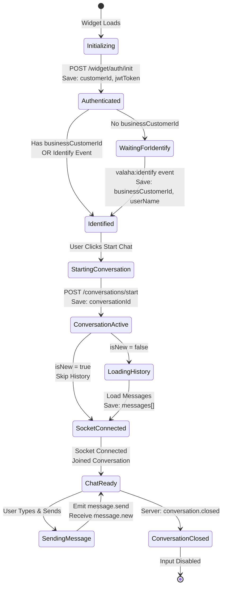

# Widget System Flow Diagram

## System Interaction Flow

```mermaid
flowchart TD
    Start([Page Load]) --> Init[Widget Initialization]

    Init --> GetExternalId{Get/Create<br/>externalId}
    GetExternalId --> PostInit[POST /widget/auth/init<br/>externalId]
    PostInit --> SaveAuth[Save customerId & JWT Token]
    SaveAuth --> MountWidget[Mount Widget UI]
    MountWidget --> ListenEvents[Setup Event Listeners]

    ListenEvents --> CheckUser{User Logged In?}

    %% User Not Logged In Flow
    CheckUser -->|No| WaitForIdentify[Wait for Identify Event]
    WaitForIdentify --> IdentifyEvent[Frontend dispatches<br/>valaha:identify event]
    IdentifyEvent --> IdentifyAPI[POST /widget/auth/identify<br/>externalId + userData]
    IdentifyAPI --> SaveIdentify[Save businessCustomerId<br/>& userName in State]
    SaveIdentify --> UpdateUI[Update Widget Header<br/>Show User Name]

    %% User Already Logged In Flow
    CheckUser -->|Yes| HasBusinessId{businessCustomerId<br/>exists?}

    %% Start Conversation Flow - With businessCustomerId
    HasBusinessId -->|Yes| StartConvWithBC[POST /widget/conversations/start<br/>?businessCustomerId=xxx]
    StartConvWithBC --> SaveConvId[Save conversationId]
    SaveConvId --> CheckIsNew{isNew?}

    CheckIsNew -->|No| LoadHistoryBC[GET /widget/messages<br/>?businessCustomerId=xxx]
    LoadHistoryBC --> RenderMessagesBC[Render Messages]
    RenderMessagesBC --> ConnectSocket[Connect Socket & Join]
    ConnectSocket --> ShowUserName[Show User Name in Header]
    ShowUserName --> ChatReadyBC[Chat Ready]

    CheckIsNew -->|Yes| ConnectSocketNew[Connect Socket & Join]
    ConnectSocketNew --> ShowUserNameNew[Show User Name in Header]
    ShowUserNameNew --> ChatReadyNew[Chat Ready - New Conversation]

    %% Start Conversation Flow - Without businessCustomerId
    HasBusinessId -->|No| StartConvNormal[POST /widget/conversations/start<br/>uses customerId]
    StartConvNormal --> SaveConvIdNormal[Save conversationId]
    SaveConvIdNormal --> CheckIsNewNormal{isNew?}

    CheckIsNewNormal -->|No| LoadHistoryNormal[GET /widget/messages<br/>/conversationId]
    LoadHistoryNormal --> RenderMessagesNormal[Render Messages]
    RenderMessagesNormal --> ConnectSocketNormal[Connect Socket & Join]
    ConnectSocketNormal --> ShowDefault[Show Default Subtitle]
    ShowDefault --> ChatReadyNormal[Chat Ready]

    CheckIsNewNormal -->|Yes| ConnectSocketNewNormal[Connect Socket & Join]
    ConnectSocketNewNormal --> ShowDefaultNew[Show Default Subtitle]
    ShowDefaultNew --> ChatReadyNewNormal[Chat Ready - New Conversation]

    %% After Identify
    UpdateUI --> HasBusinessId

    %% Message Sending
    ChatReadyBC --> SendMessage[User Sends Message]
    ChatReadyNew --> SendMessage
    ChatReadyNormal --> SendMessage
    ChatReadyNewNormal --> SendMessage

    SendMessage --> EmitSocket[Emit message.send<br/>via Socket.IO]
    EmitSocket --> ReceiveMessage[Receive message.new<br/>from Server]
    ReceiveMessage --> DisplayMessage[Display Message in UI]

    style Start fill:#e1f5ff
    style IdentifyEvent fill:#fff4e1
    style IdentifyAPI fill:#fff4e1
    style SaveIdentify fill:#fff4e1
    style StartConvWithBC fill:#d4edda
    style LoadHistoryBC fill:#d4edda
    style ShowUserName fill:#d4edda
    style StartConvNormal fill:#f8d7da
    style LoadHistoryNormal fill:#f8d7da
    style ShowDefault fill:#f8d7da
    style ChatReadyBC fill:#c3e6cb
    style ChatReadyNew fill:#c3e6cb
    style ChatReadyNormal fill:#c3e6cb
    style ChatReadyNewNormal fill:#c3e6cb
```



## Detailed Comparison: With vs Without businessCustomerId

```mermaid
graph TB
    subgraph "Case 1: User NOT Identified (No businessCustomerId)"
        A1[Widget Init] --> B1[POST /widget/auth/init<br/>externalId only]
        B1 --> C1[Save customerId]
        C1 --> D1[User Clicks Start Chat]
        D1 --> E1[POST /widget/conversations/start<br/>uses customerId from state]
        E1 --> F1{isNew?}
        F1 -->|No| G1[GET /widget/messages/conversationId]
        F1 -->|Yes| H1[Skip History Load]
        G1 --> I1[Render Messages]
        H1 --> I1
        I1 --> J1[Connect Socket]
        J1 --> K1[Header: We reply in minutes]
    end

    subgraph "Case 2: User Identified (Has businessCustomerId)"
        A2[Widget Init] --> B2[POST /widget/auth/init<br/>externalId only]
        B2 --> C2[Save customerId]
        C2 --> D2[Frontend: valaha:identify event]
        D2 --> E2[POST /widget/auth/identify<br/>externalId + businessCustomerId + name + email + phone]
        E2 --> F2[Save businessCustomerId & userName]
        F2 --> G2[Update Header: Show User Name]
        G2 --> H2[User Clicks Start Chat]
        H2 --> I2[POST /widget/conversations/start<br/>?businessCustomerId=xxx]
        I2 --> J2{isNew?}
        J2 -->|No| K2[GET /widget/messages?businessCustomerId=xxx]
        J2 -->|Yes| L2[Skip History Load]
        K2 --> M2[Render Messages]
        L2 --> M2
        M2 --> N2[Connect Socket]
        N2 --> O2[Header: User Name displayed]
    end

    style A1 fill:#f8d7da
    style E1 fill:#f8d7da
    style G1 fill:#f8d7da
    style K1 fill:#f8d7da
    style A2 fill:#d4edda
    style E2 fill:#d4edda
    style I2 fill:#d4edda
    style K2 fill:#d4edda
    style O2 fill:#d4edda
```



## State Management Flow



## API Endpoints Usage

```mermaid
graph LR
    subgraph "Initialization"
        A[POST /widget/auth/init] --> B[externalId]
        B --> C[Returns: customerId, token]
    end

    subgraph "Identification Optional"
        D[POST /widget/auth/identify] --> E[externalId + businessCustomerId<br/>+ name + email + phone]
        E --> F[Links user data to customer]
    end

    subgraph "Start Conversation"
        G{Has businessCustomerId?}
        G -->|Yes| H[POST /widget/conversations/start<br/>?businessCustomerId=xxx]
        G -->|No| I[POST /widget/conversations/start<br/>uses customerId from state]
        H --> J[Returns: conversationId, isNew]
        I --> J
    end

    subgraph "Load History"
        K{Has businessCustomerId?}
        K -->|Yes| L[GET /widget/messages<br/>?businessCustomerId=xxx]
        K -->|No| M[GET /widget/messages<br/>/conversationId]
        L --> N[Returns: MessageResponseDto[]]
        M --> N
    end

    style D fill:#fff4e1
    style E fill:#fff4e1
    style H fill:#d4edda
    style L fill:#d4edda
    style I fill:#f8d7da
    style M fill:#f8d7da
```
